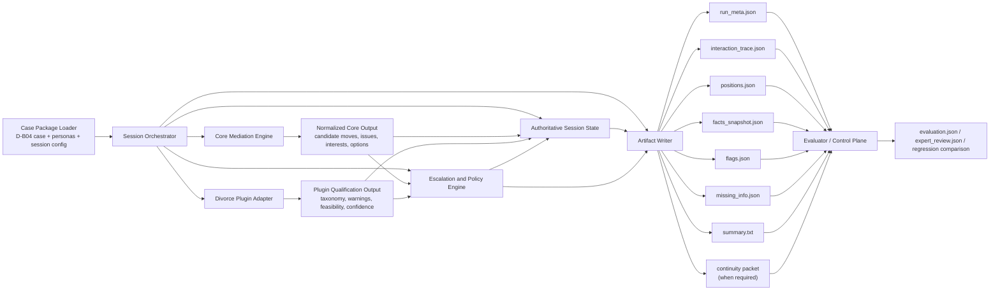

# ARCH-002: Component Diagram

**Status**  
Draft / informative

**Purpose**  
This document provides the first component-level diagram for Solomon's offline evaluation-phase runtime.

It is derived from:

- `ARCH-001-first-runtime-architecture-outline.md`
- `docs/03_MVP Eval Intent Lock.md`
- the runtime contract pack
- the `D-B04-S01` worked reference session

This diagram is intended to show:

- the minimum runtime components
- the authority boundary between them
- the main data and control flows
- where evaluator-facing outputs are produced

This diagram should be interpreted as an MVP evaluation-runtime diagram, not as a production deployment diagram.

---

## 1. Reading guidance

Use this diagram to answer:

- which component owns what
- which components are in the runtime path
- which outputs are authoritative
- where plugin qualification and escalation happen
- how evaluator tooling relates to the runtime without controlling it

Read it together with the intent lock: the goal here is evaluator-reviewable artifact production and appropriate escalation behavior under bounded synthetic conditions.

---

## 2. First-pass component diagram

---

## 3. Component responsibilities

### Case Package Loader

Owns:

- case and persona loading
- benchmark/session selection
- initialization inputs to the orchestrator

### Session Orchestrator

Owns:

- runtime step ordering
- component invocation order
- close conditions
- phase progression

### Core Mediation Engine

Owns:

- role framing
- issue clarification candidates
- interest elicitation candidates
- bounded option-generation candidates
- summary/rationale drafting support

### Divorce Plugin Adapter

Owns:

- domain issue structure
- domain warnings
- feasibility qualification
- missing-domain-information signals
- plugin confidence

### Escalation and Policy Engine

Owns:

- thresholding
- routing
- policy-profile enforcement
- final mode/category selection
- escalation rationale

### Artifact Writer

Owns:

- authoritative write/update of runtime artifacts
- derived summary refresh
- continuity-packet generation when required

### Evaluator / Control Plane

Owns:

- artifact consumption after the run
- scoring
- expert review
- regression comparison

---

## 4. Authority notes

The key authority boundaries are:

- the model does not own authoritative state
- the plugin does not own final routing
- the orchestrator does not replace the escalation engine
- the artifact writer, not the model, owns output persistence shape
- evaluator tooling consumes artifacts after the runtime rather than steering it directly
- the runtime components are arranged to support bounded offline evaluation, not to imply a final live-service topology

---

## 5. D-B04-S01 interpretation

For `D-B04-S01`, the most important paths are:

1. `Core Mediation Engine` surfaces positions, interests, and bounded options.
2. `Divorce Plugin Adapter` constrains those options with logistics and feasibility signals.
3. `Escalation and Policy Engine` selects `M1` rather than stronger escalation.
4. `Artifact Writer` preserves that reasoning across trace, flags, missing info, and summary.

That path is the baseline component test for the first implementation.

---

## 6. Immediate follow-on

This component diagram should be used together with:

- `ARCH-003-turn-loop-sequence-diagram.md`
- `ARCH-004-persistence-profiles-matrix.md`

Those documents make the control flow and policy behavior more concrete.
