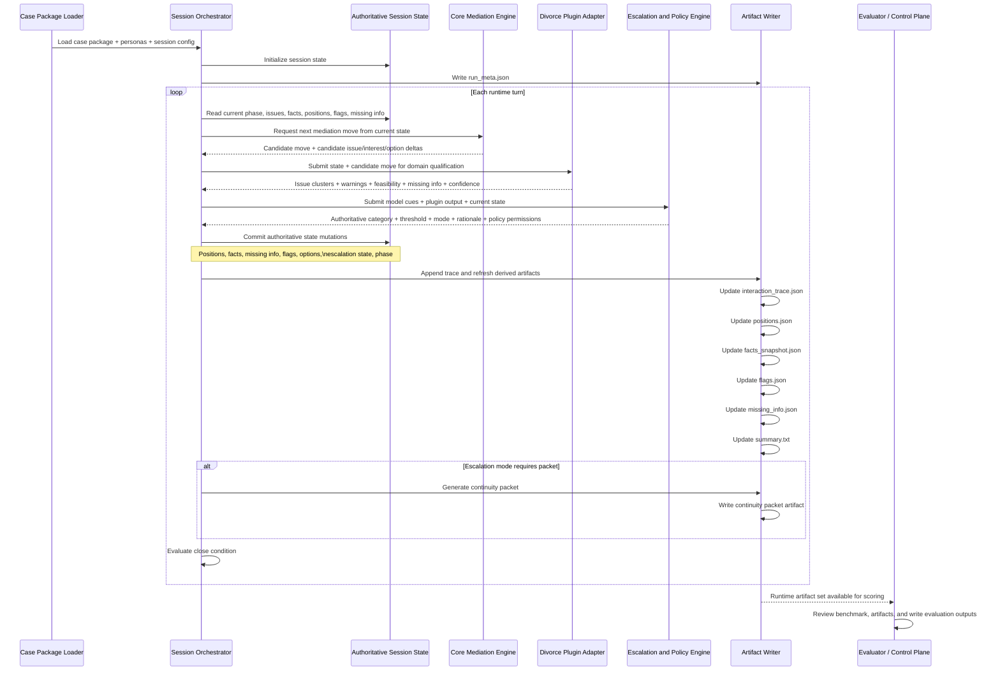

# ARCH-003: Turn-Loop Sequence Diagram

**Status**  
Draft / informative

**Purpose**  
This document defines the first turn-loop sequence for Solomon's offline evaluation-phase runtime.

It expands the runtime flow in `ARCH-001` into a component interaction sequence that is concrete enough to guide implementation.

It inherits the current phase target from `docs/03_MVP Eval Intent Lock.md`: produce evaluator-reviewable, domain-qualified artifacts with appropriate escalation behavior in bounded synthetic cases.

It is anchored to `D-B04-S01`, where the runtime must:

- capture positions
- surface interests
- identify missing logistics
- apply plugin qualification
- choose `M1`
- emit coherent artifacts

---

## 1. Reading guidance

This sequence is the baseline loop for one runtime turn.

It is not intended to represent:

- a final production protocol
- a distributed service mesh
- a streaming UI exchange
- a live disputant-facing interaction contract

It is the first implementation sequence for a step-orchestrated offline runtime.

---

## 2. Baseline turn-loop sequence

---

## 3. D-B04-S01 turn-loop interpretation

For `D-B04-S01`, the key runtime behavior inside this loop is:

- the core surfaces a neutral candidate move
- the plugin identifies unresolved school logistics and limited domain confidence
- the escalation engine translates those signals into `E5` / `T1` / `M1`
- the artifact writer preserves that decision coherently

This keeps the baseline run from drifting into premature recommendation or opaque caution.

---

## 4. Step-by-step control rules

### 4.1 Load and initialize

The orchestrator should initialize:

- benchmark context
- participant identities
- policy profile
- empty or seed state for issues, positions, facts, flags, and missing information

### 4.2 Core generation

The core engine should return:

- candidate conversational text or structured move
- candidate issue updates
- candidate interest updates
- candidate option updates
- candidate rationale fragments

These are proposals, not authoritative state.

### 4.3 Plugin qualification

The plugin adapter should evaluate:

- issue-map alignment
- domain warnings
- feasibility qualification
- missing domain information
- plugin confidence

For `D-B04-S01`, this is where unresolved school logistics become implementation-relevant constraints rather than only narrative concerns.

### 4.4 Escalation and policy decision

The escalation engine should consume:

- current state
- candidate model cues
- plugin warnings
- plugin confidence
- rolling context from prior turns

It should emit:

- authoritative escalation category
- threshold band
- mode
- short rationale
- policy/write permissions

### 4.5 Authoritative commit

Only after the escalation and policy decision should the runtime commit:

- facts
- positions
- flags
- missing information
- option state
- escalation state

This prevents the model from becoming the hidden state authority.

### 4.6 Artifact refresh

The artifact writer should:

- append one trace entry
- rewrite or refresh derived state artifacts
- preserve consistency across files

For the first version, consistency is more important than write efficiency.

---

## 5. Close conditions

The orchestrator should end the loop when one of the following is true:

- the slice objective has been met
- the session reaches a stable bounded next-step state
- an escalation/handoff path requires exit
- policy requires stop or redirection

For `D-B04-S01`, the loop closes when:

- missing logistics are explicit
- phased exploration remains tentative
- `M1` is clearly justified
- the next step is bounded enough for evaluator review

---

## 6. Implementation notes

### 6.1 Why this is step-orchestrated

This sequence is intentionally step-orchestrated because it:

- makes authority boundaries visible
- supports replay and debugging
- aligns naturally with artifact writes
- fits evaluator-centered offline review
- keeps the implementation optimized for the current MVP evaluation objective rather than speculative production flexibility

### 6.2 Why artifact writing is inside the loop

Artifact writing happens during the loop because:

- the trace is turn-level
- caution and missing info may emerge gradually
- evaluator review depends on coherent intermediate state, not just final summary

### 6.3 Why evaluator tooling is outside the loop

The evaluator plane should remain downstream so the runtime can be judged from emitted evidence rather than from privileged hidden state.

That separation is part of the current phase intent lock, not just a convenience of the first implementation.

---

## 7. Immediate follow-on

This sequence should be used to derive:

- concrete orchestrator interfaces
- state mutation rules
- artifact writer contracts in code
- test harnesses for replaying `D-B04-S01`
